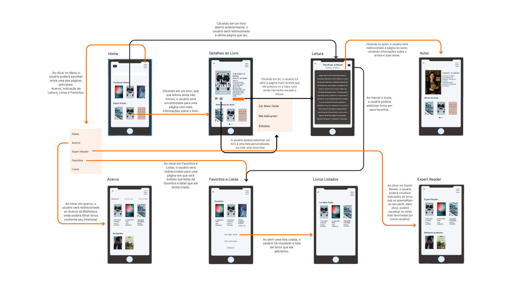
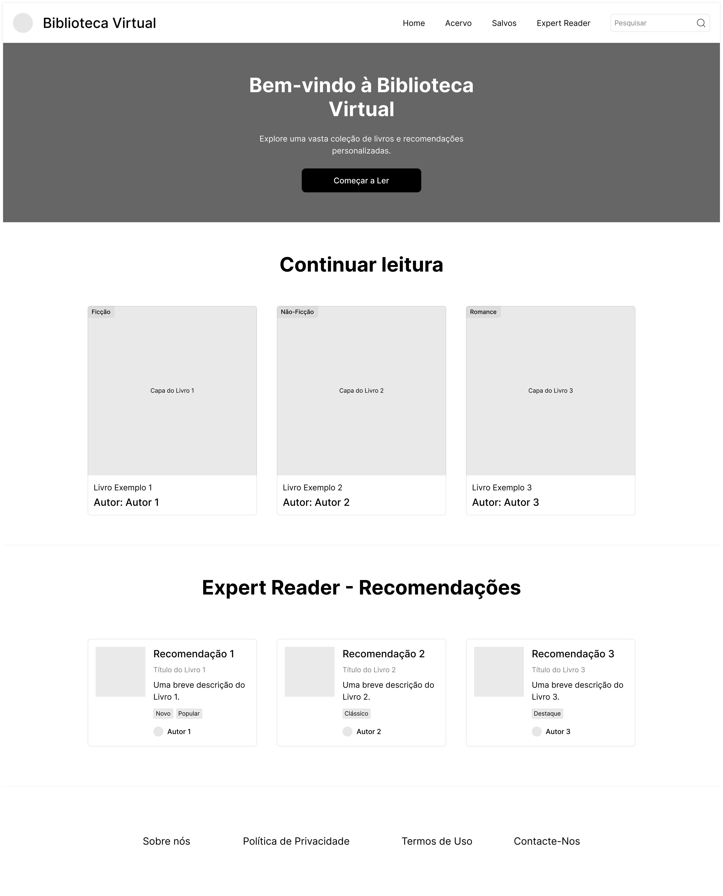
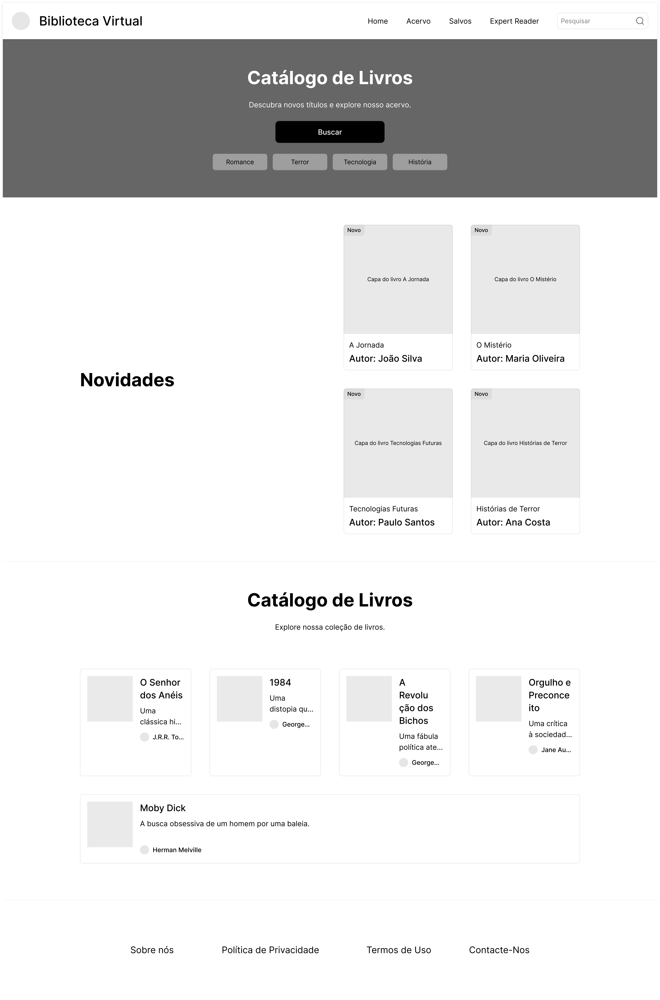
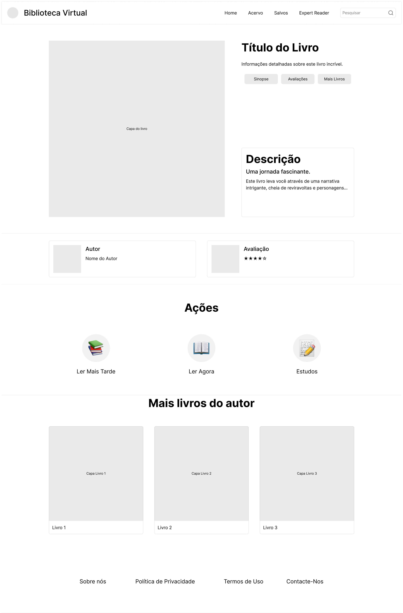
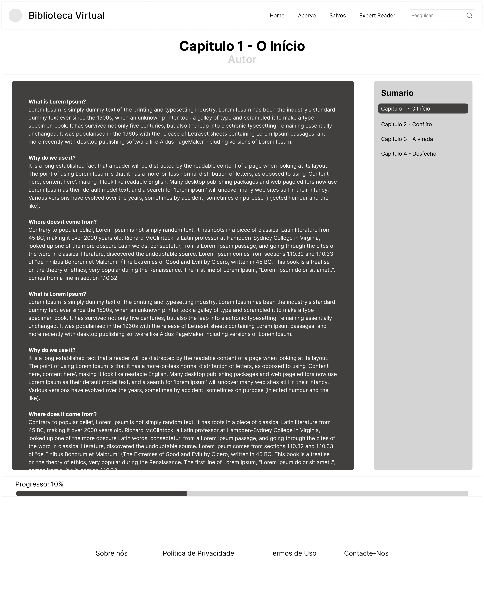
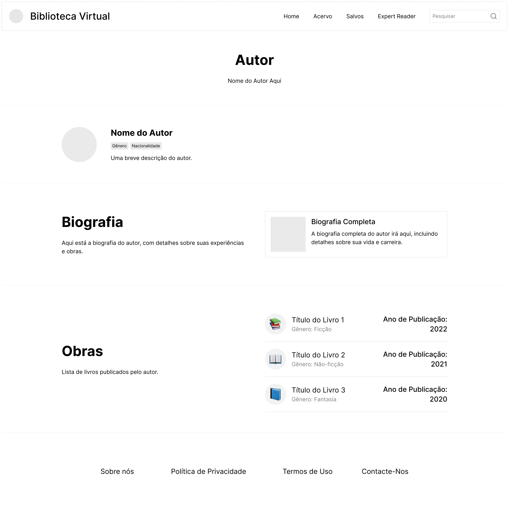
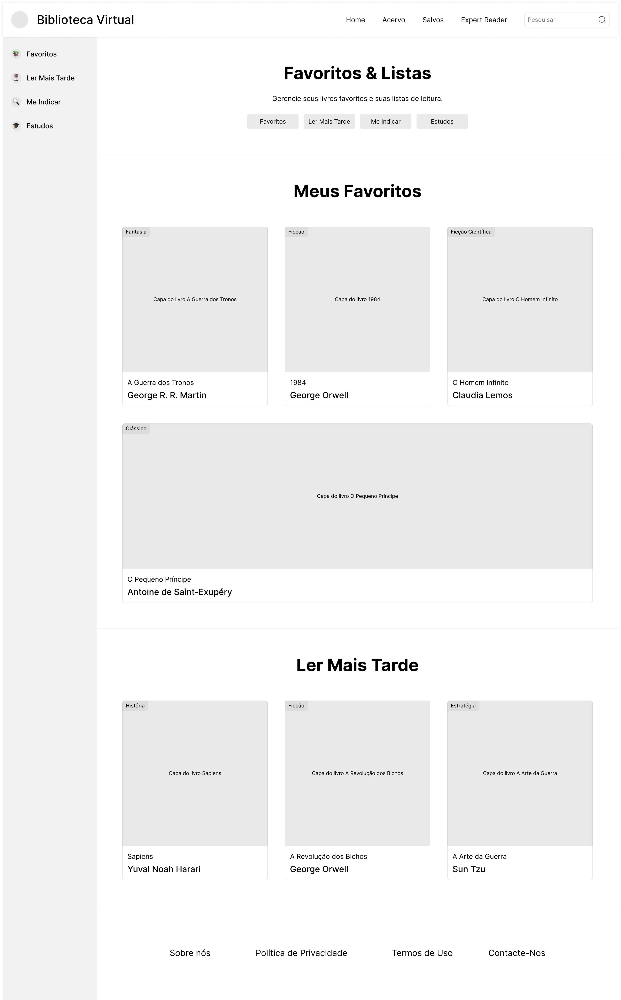
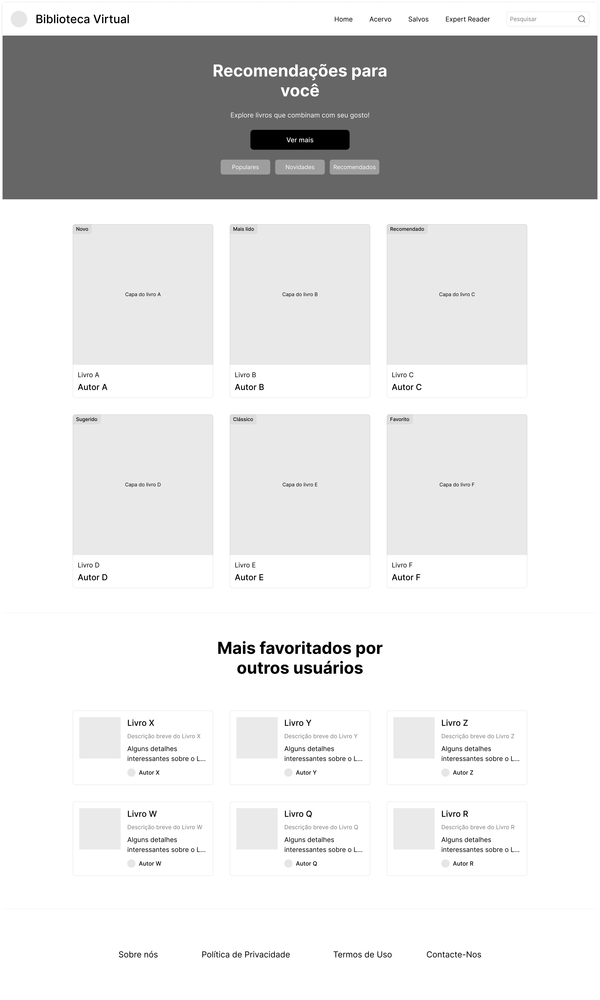

# Projeto de Interface

Visão geral da interação do usuário pelas telas do sistema e protótipo interativo das telas com as funcionalidades que fazem parte do sistema (wireframes).

 Apresente as principais interfaces da plataforma. Discuta como ela foi elaborada de forma a atender os requisitos funcionais, não funcionais e histórias de usuário abordados nas <a href="2-Especificação do Projeto.md"> Documentação de Especificação</a>.

## User Flow

O fluxo de navegação da aplicação foi pensado para ser direto e fácil de usar, acompanhando o usuário em todas as interações com a biblioteca online. Na página inicial, é possível retomar rapidamente a leitura em andamento, ver recomendações de leitura e acessar as principais seções do sistema. Pelo menu hamburguer, o usuário pode navegar entre Home, Acervo, Expert Reader, Favoritos e Listas, mantendo as funções sempre acessíveis.

Ao clicar em um livro, o usuário pode seguir dois caminhos: se já iniciou a leitura, será levado para a última página acessada; se ainda não começou, será direcionado para a página de detalhes, com informações adicionais, recomendações e opções de adicionar o título a listas personalizadas e/ou favoritos. A leitura é contínua e conta com ações práticas, como salvar para ler mais tarde ou incluir em favoritos. O fluxo também permite que o usuário acesse informações sobre o autor e suas obras.

A seção Expert Reader sugere livros de acordo com o perfil do usuário e apresenta os mais bem avaliados por outros leitores. No Acervo, é possível explorar títulos por categorias, enquanto a área de Favoritos e Listas reúne os livros marcados e as listas criadas. 

O userflow foi pensado em garantir simplicidade e boa experiência de navegação ao usuário. Outras funcionalidades podem ser integradas futuramente. 

## Wireframes

 
> **Links Úteis**:
> - [Protótipos vs Wireframes](https://www.nngroup.com/videos/prototypes-vs-wireframes-ux-projects/)
> - [Ferramentas de Wireframes](https://rockcontent.com/blog/wireframes/)
> - [MarvelApp](https://marvelapp.com/developers/documentation/tutorials/)
> - [Figma](https://www.figma.com/)
> - [Adobe XD](https://www.adobe.com/br/products/xd.html#scroll)
> - [Axure](https://www.axure.com/edu) (Licença Educacional)
> - [InvisionApp](https://www.invisionapp.com/) (Licença Educacional)
